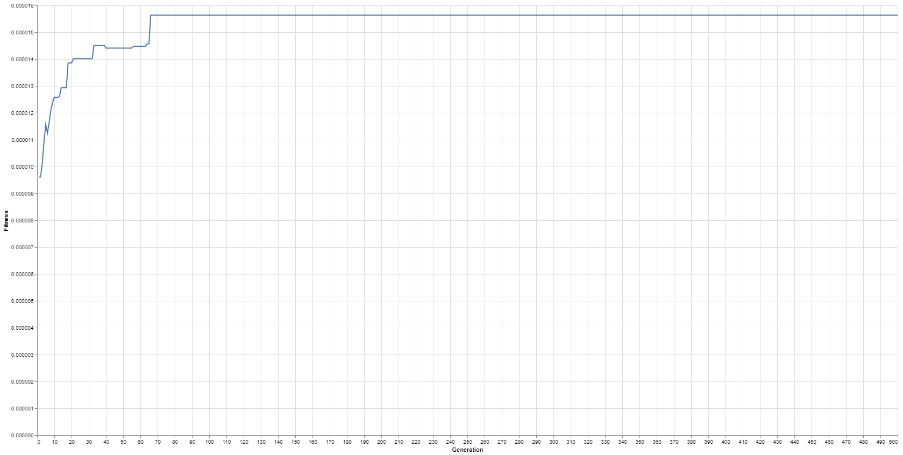

# ga-clj

GA Algorithm for the Traveling Salesman Problem in Clojure

## Usage

Just run

    $ java -jar ga-clj-0.1.0-SNAPSHOT-standalone.jar [args]

## Options

    -p, --port PORT                         5050  Port number
    -c, --num-cities NUM_CITIES             15    Number of cities
    -ps, --population-size POPULATION_SIZE  150   Population size
    -g, --num-generations NUM_GENERATIONS   500   Number of generations
    -m, --mutation-rate MUTATION_RATE       0.01  Mutation rate
    -e, --elite-size ELITE_SIZE             20    Elite size

## Examples

Here's an example of the fitness as it changes between generations

